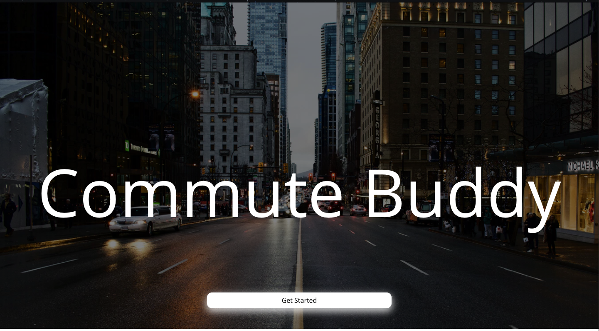

# Commute Buddy

Tired of having to check multiple sources each morning in preparation for you commute? Let Commute buddy check traffic, weather, detours, and events for you! Commute buddy will notify you if anything occurs that will cause a delay in your daily commute and give you suggestions on alternate routes or ways to get to your destination



## Built With

* [React](https://reactjs.org/)
* [Node.js](https://nodejs.org/)
* [Express](https://expressjs.com/)
* [PostgresSQL](https://www.postgresql.org/)
* [Firebase Authentication](https://firebase.google.com/docs/auth)


## Data

[Google Maps JavascriptAPI](https://developers.google.com/maps/documentation/javascript/tutorial)

> The Maps JavaScript API lets you customize maps with your own content and imagery for display on web pages and mobile devices. The Maps JavaScript API features four basic map types (roadmap, satellite, hybrid, and terrain) which you can modify using layers and styles, controls and events, and various services and libraries.

[Twilio SMS](https://www.twilio.com/docs/sms)

> Text messaging. SMS. Use the Twilio API for SMS to send and receive text messages over the carrier network to any phone, anywhere in the world. From a Twilio phone number, SMS messages are delivered globally.

## Getting Started

These instructions will get you a copy of the project up and running on your local machine for development and testing purposes. See deployment for notes on how to deploy the project on a live system.

### How to Set Up

- In terminal, in home directory `~`, clone the repo, `git clone https://github.com/karolina-benitez/Commute-Buddy.git`.
- In terminal, `cd Commute-Buddy`, run `npm i -S body-parser dotenv express pg` 
- This will install: [body-parser](https://github.com/expressjs/body-parser), [dotenv](https://www.npmjs.com/package/dotenv), [express](https://expressjs.com/), and [node-postgres](https://www.npmjs.com/package/pg).

- Download and install [PostgresSQL](https://www.postgresql.org/).
- Open PostgresSQL, create a connection using `Host: localhost`. The port is 5432 by default.
- In the connection, add a database named `commutebuddy`.
- Go to `commutebuddy` database, run the following query to create a table called `udata`.

```
CREATE TABLE udata (
  id SERIAL,
  uid VARCHAR, 
  firstname VARCHAR, 
  lastname VARCHAR,
  email VARCHAR,
  phonenumber INT,
  trafficalert BOOLEAN DEFAULT FALSE,
  eventalert BOOLEAN DEFAULT FALSE,
  weatheralert BOOLEAN DEFAULT FALSE,
  transitalert BOOLEAN DEFAULT FALSE,

);
```

- Next, create a table called `trips`.

```
CREATE TABLE trips (
  id SERIAL,
  uid VARCHAR, 
  origin VARCHAR, 
  destination VARCHAR, 
  arrivedate DATE
);
```

- Signup for [Firebase](https://firebase.google.com/docs/auth), Firebase creates a `uid` for each user that signs up

- In terminal, `cd ../client`, to go back to `/client` folder, run `npm i -S firebase react-bootstrap react-datepicker react-router-dom` 
- This will install: [firebase](https://firebase.google.com), [react-bootstrap](https://react-bootstrap.github.io/), [react-datepicker](https://www.npmjs.com/package/react-datepicker), and [react-router-dom](https://www.npmjs.com/package/react-router-dom).

- In the /client folder, run `npm start`, enjoy!
